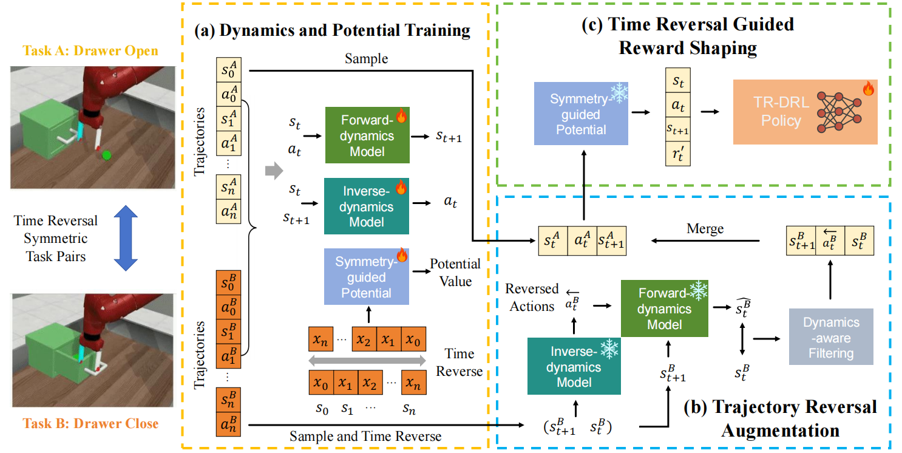
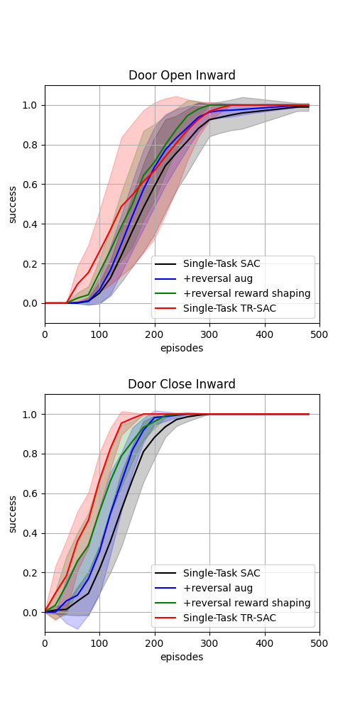
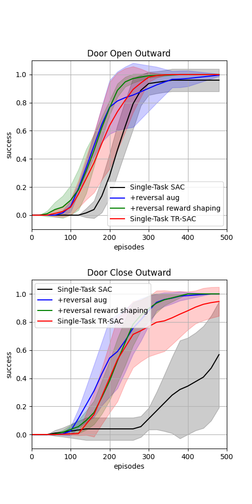
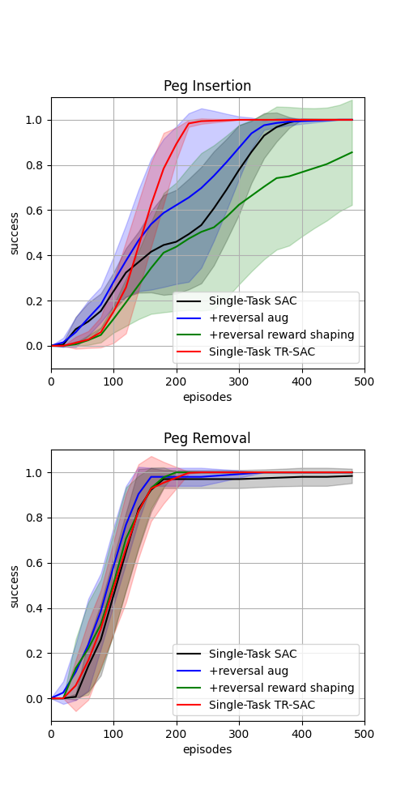
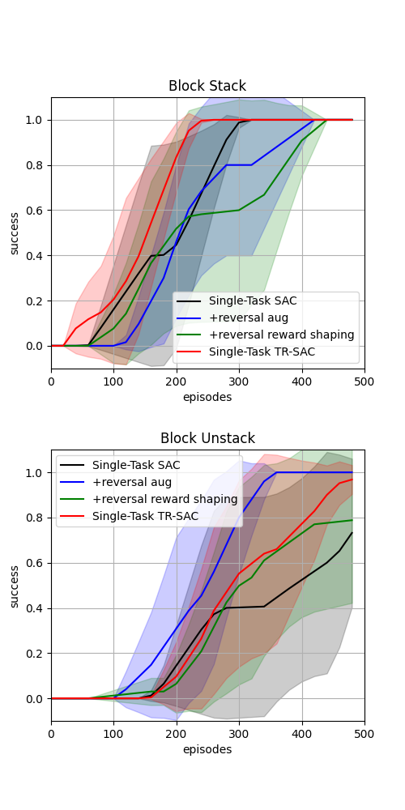
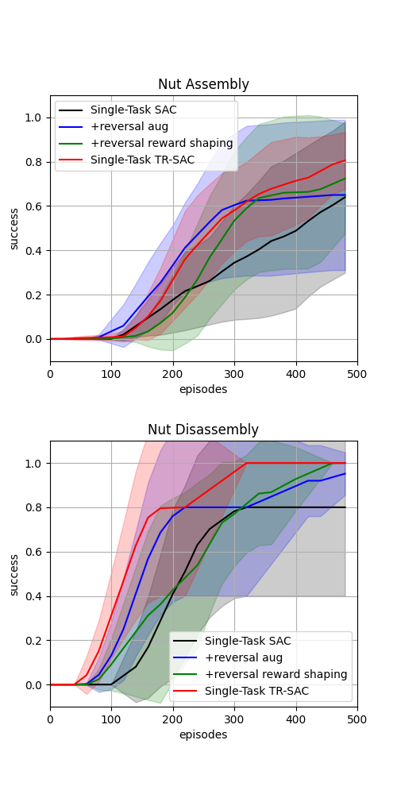
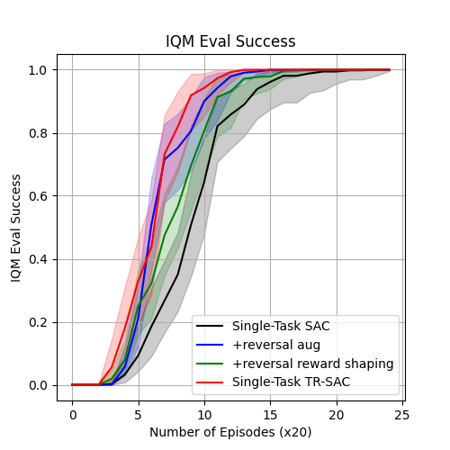

# TR-DRL
Official implementation of the NeurIPS2025 paper [Time Reversal Symmetry for Efficient Robotic Manipulations in Deep Reinforcement Learning](https://arxiv.org/abs/2505.13925), which introduces Time-Reversal enhanced Deep Reinforcement Learning (TR-DRL) to boost sample efficiency and final performance of DRL agents.

For demo and summary videos, visit our [project website](https://jyp9961.github.io/TR-DRL_project_page/).



## Installation

Create and activate the environment using the provided `environment.yaml`:

```bash
conda env create -f environment.yaml

conda activate TR-DRL
```

## Single Task TR-SAC in Robosuite 
```bash
cd robosuite/
```

Train two SAC agents on robosuite for a pair of reversible tasks (door open/close outward) with TR-DRL. (Single-Task TR-DRL)
```
python train_sac_agentenv_2agents_state.py --reward_shaping f --use_reversed_transition t --filter_type state_max_diff --diff_threshold 0.01 --use_reversed_reward t --use_forward_reward t --reward_model_type potential --potential_type linear --n_demo 10 --env1_name Door --env2_name Door_Close --seed 1
```
You may specify any value for `--seed`. 
Our reported results in the paper were obtained using five seeds from 1 to 5.

Other task pairs that can replace ("Door", "Door_Close"): Old_Door, Old_Door_Close (door open/close inward); NutAssemblyRound, NutDisAssemblyRound (nut assembly/disassembly); TwoArmPegInHole, TwoArmPegRemoval (peg insertion/removal); Stack, UnStack (block stacking/unstacking).

Results (log files and saved videos) obtained from the above experiment can be found in `runs/{algo_name}/{env_name}_seed{--seed}/`. Move them to `results/{algo_name}/` by running the following command.
```
mv runs/{algo_name}/{env_name}_seed*/ results/{algo_name}/
```

Then you can run `plot.py` to visualize the results. You may search for `env_names` in `plot.py` and change them.
```
python plot.py
```
After this command, it will show you some plots similar to those in `plots/`.

<p align="center">
      
      
      
</p>
<p align="center">
      
      
      
</p>

## Multi-Task TR-SAC in MetaWorld (fixed goals)
```bash
cd metaworld/
```

Train one multi-task SAC agent on MetaWorld for a pair of reversible tasks (drawer-open/close) with TR-DRL. (Task-conditioned TR-DRL)
```
python train_sac_ntasks_state.py --reward_shaping f --env1_name drawer-open --env2_name drawer-close --use_forward_reward t --use_reversed_reward t --reward_model_type potential --potential_type linear --use_reversed_transition t --diff_threshold 0.01 --filter_type state_max_diff --seed 1 --n_demo 10
```

Train one multi-task SAC agent on MetaWorld for MT50 with TR-DRL. (Language-conditioned TR-DRL)
```
python train_sac_MT.py --reward_shaping f --use_forward_reward t --use_reversed_reward t --reward_model_type potential --potential_type linear --use_reversed_transition t --diff_threshold 0.01 --filter_type state_max_diff --seed 1 --n_demo 10 --batch_size 32 --num_envs 50
```

## Multi-Task TR-MOORE in MetaWorld (random goals) (Recommended)
This is recommended, since it is built upon MOORE [3], a more recent and advanced baseline than SAC for multi-task RL.

In `MOORE/`, create and activate the environment using the provided `moore_metaworld.yml`:

```bash
cd MOORE/

conda env create -f moore_metaworld.yml

conda activate moore_metaworld
```

Install the Metaworld environment in `MOORE/`.

```bash
git clone https://github.com/Farama-Foundation/Metaworld.git

cd Metaworld

git checkout a98086a

pip install -e .
```

Return to `MOORE/`, and train one TR-MOORE agent on MetaWorld-MT50.
```bash
cd ../

bash run/metaworld/mt50_trmoore/run_metaworld_mt50_mhsac_mt_trmoore_seed1.sh
```

# Reference
[1] Zhu, Yuke, et al. "robosuite: A Modular Simulation Framework and Benchmark for Robot Learning." 2025.

[2] Yu, Tianhe, et al. "Meta-world: A benchmark and evaluation for multi-task and meta reinforcement learning." Conference on robot learning. PMLR, 2020.

[3] Hendawy, Ahmed, et al. "Multi-Task Reinforcement Learning with Mixture of Orthogonal Experts." International Conference on Learning Representations. ICLR, 2024.

# Citation
```
@misc{jiang2025timereversalsymmetryefficient,
      title={Time Reversal Symmetry for Efficient Robotic Manipulations in Deep Reinforcement Learning}, 
      author={Yunpeng Jiang and Jianshu Hu and Paul Weng and Yutong Ban},
      year={2025},
      eprint={2505.13925},
      archivePrefix={arXiv},
      primaryClass={cs.RO},
      url={https://arxiv.org/abs/2505.13925}, 
}
```
